# ICTC VLM Clustering — GPU Scripts

Production-ready scripts implementing **Image Clustering Conditioned on Text Criteria (ICTC)** for large-scale image clustering using a unified **Qwen3.5-27B** model.

Based on **Experiment 3B** findings: a single Qwen 3.5 model handles both vision captioning and text reasoning, producing better clusters than a separate VLM + LLM pipeline (higher coherence, better balance, zero unclassified ads).

---

## Repository Contents

| File | Description |
|------|-------------|
| `ictc_cluster.py` | **Multi-GPU production pipeline** — unified or separate model modes, tensor parallelism, full crash resume |
| `ictc_cluster_single_gpu.py` | **Single-GPU shard script (Track 1)** — Marketing Strategy prompts, horizontal scaling across VMs |
| `ictc_cluster_single_gpu_track2.py` | **Single-GPU shard script (Track 2)** — Algorithmic Identity & Profiling prompts |
| `ictc_cluster_single_gpu_track3.py` | **Single-GPU shard script (Track 3)** — Cultural Representation & Social Values prompts |
| `run_ictc.sh` | tmux wrapper for SSH-resilient execution on cluster nodes |
| `run_ictc_single_gpu.sh` | tmux wrapper for Track 1 single-GPU runs |
| `run_ictc_track2.sh` | tmux wrapper for Track 2 single-GPU runs (session: `ictc_t2`) |
| `run_ictc_track3.sh` | tmux wrapper for Track 3 single-GPU runs (session: `ictc_t3`) |
| `ictc_recluster.py` | **Re-clustering script** — re-run Steps 2a/2b/3 from existing VLM captions with a different K, without overwriting originals |
| `run_recluster_k10.sh` | tmux wrapper to re-cluster all 3 tracks with K=10 (session: `ictc_k10`) |
| `requirements_cluster.txt` | pip dependencies (torch, vLLM, transformers, pillow, tqdm) |
| `analysis/eda_and_findings.py` | **EDA script** — 15 figures covering dataset overview, cluster distributions, platform analysis, data quality |
| `analysis/research_findings.py` | **Research findings script** — 5 figures answering RQ1 (track effect) and RQ2 (K effect), plus recommendations |
| `analysis/figures/` | All 20 generated figures (see [Analysis Figures Reference](#analysis-figures-reference)) |

---

## Pipeline

The pipeline has 4 steps, shared across all tracks. Only the **prompts** differ between tracks:

```
Step 0  Discovery   Scan dataset, build image map
Step 1  VLM         Qwen3.5 captions each image → {category, brand, text, summary}
Step 2a Text        Same model extracts a 2-4 word label per ad
Step 2b Text        Same model synthesises top labels → K cluster definitions  (single call)
Step 3  Text        Same model assigns each ad to its best-fitting cluster
```

Default model: **Qwen/Qwen3.5-27B** — natively multimodal (early fusion), handles all steps without model swap.

Legacy mode: pass `--llm_model <model_id>` to use a separate LLM for Steps 2a/2b/3 (multi-GPU script only).

### Prompt Tracks

| Track | Script | Criterion | What Step 1 Extracts | Step 2a Label |
|-------|--------|-----------|----------------------|---------------|
| **Track 1** — Marketing Strategy | `ictc_cluster_single_gpu.py` | `Marketing Strategy` | Generic ad description (brand, text, visual summary) | "marketing hook" (e.g., "scarcity urgency") |
| **Track 2** — Algorithmic Identity | `ictc_cluster_single_gpu_track2.py` | `Algorithmic Identity Profiling` | "Assumed User Identity" — socio-economic status, gender performance, cultural signals, lifestyle the ad assumes the viewer has | "algorithmic persona" (e.g., "hustle-culture tech bro") |
| **Track 3** — Cultural Representation | `ictc_cluster_single_gpu_track3.py` | `Cultural Representation & Social Values` | Cultural content & representation — people shown, settings, lifestyles portrayed, values/aspirations communicated, aesthetic and tone | "cultural theme" (e.g., "aspirational wealth display") |

Track 2 is designed for researching the **"Data Double"** — what kind of demographic buckets the algorithm places individuals into based on the ads they are shown. The Step 2b prompt adopts the role of a *Critical Data Scholar* researching surveillance capitalism and algorithmic identity profiling.

Track 3 is designed for studying how advertising reflects and constructs **cultural narratives and social values**. It enables research on identity, representation, consumer culture, and social norms — what lifestyles and identities ads promote as desirable, what cultural values are embedded, and how ads shape norms around gender, class, health, or success. The Step 2b prompt adopts the role of a *Cultural Studies Researcher*.

All tracks share the same pipeline logic, checkpoint system, and CLI flags. They differ **only in the prompt constants** at the top of each script.

---

## Quick Start

```bash
# 1. Clone
git clone git@github.com:GrigoriusPompeus/summer_research_distilled_script_for_gpu.git
cd summer_research_distilled_script_for_gpu

# 2. Install dependencies (on the GPU cluster)
pip install -r requirements_cluster.txt
# Optional but recommended on A100/H100:
pip install flash-attn --no-build-isolation

# 3. Smoke test (100 images, verify GPU + model load)
python ictc_cluster.py \
  --ads_dir  /data/dataset/ads \
  --output_dir /data/results/test \
  --max_images 100 --verbose

# 4. Full run via tmux (edit ADS_DIR / OUTPUT_DIR inside run_ictc.sh first)
chmod +x run_ictc.sh
./run_ictc.sh
```

---

## Script 1: `ictc_cluster.py` — Multi-GPU Production Pipeline

Runs the full ICTC pipeline on a multi-GPU cluster. Supports two modes:

- **Unified mode** (default): Single Qwen3.5-27B model stays loaded for all steps — no expensive unload/reload.
- **Separate mode** (legacy): VLM for Step 1, unload, then load a dedicated LLM for Steps 2a/2b/3. Use `--llm_model meta-llama/Llama-3.1-8B-Instruct` to activate.

```bash
# Unified (default) — 2x A100-80GB
python ictc_cluster.py \
  --ads_dir /data/ads --output_dir /data/out

# Separate VLM + LLM (legacy)
python ictc_cluster.py \
  --ads_dir /data/ads --output_dir /data/out \
  --llm_model meta-llama/Llama-3.1-8B-Instruct

# 4-GPU node
python ictc_cluster.py \
  --ads_dir /data/ads --output_dir /data/out \
  --num_gpus 4
```

---

## Script 2: `ictc_cluster_single_gpu.py` — Single-GPU Sharding

Same pipeline, but designed for **one GPU per VM**. Multiple VMs process different image ranges, then results are merged.

Always uses unified mode (single model for all steps, `tp=1`).

```bash
# VM 1: process images 0–50k
python ictc_cluster_single_gpu.py \
  --ads_dir /data/ads --output_dir /data/out \
  --start_index 0 --end_index 50000 --shard_id shard_0

# VM 2: process images 50k–100k
python ictc_cluster_single_gpu.py \
  --ads_dir /data/ads --output_dir /data/out \
  --start_index 50000 --end_index 100000 --shard_id shard_1

# After all VMs finish — merge on any machine:
python ictc_cluster_single_gpu.py --merge_shards \
  /data/out/shard_0 /data/out/shard_1 \
  --output_dir /data/out/merged
```

Sharding is deterministic: all VMs discover the full image set, sort keys identically, then each takes its `[start_index, end_index)` slice.

---

## Script 3: `ictc_cluster_single_gpu_track2.py` — Track 2: Algorithmic Identity

Same pipeline as Track 1, but with **identity-focused prompts** analyzing who the algorithm thinks is watching each ad.

```bash
# Full run — uses same images as Track 1, separate output directory
python ictc_cluster_single_gpu_track2.py \
  --ads_dir /data/ads --output_dir /data/out \
  --shard_id track2_identity

# Or use the tmux wrapper (creates session "ictc_t2")
chmod +x run_ictc_track2.sh
./run_ictc_track2.sh
```

**Track 2 prompt differences:**

| Stage | Track 1 (Marketing) | Track 2 (Identity) |
|-------|---------------------|---------------------|
| Step 1 | Generic `visual_summary` | Analyses "Assumed User Identity" — socio-economic status, gender, cultural signals |
| Step 2a | Extracts "marketing hook" | Extracts "algorithmic persona" (e.g., "exhausted millennial parent") |
| Step 2b | Expert analyst → marketing strategy clusters | Critical Data Scholar → algorithmic identity clusters |
| Step 3 | Assigns to strategy | Assigns to identity cluster |

**Isolation**: Track 2 results go to `output_dir/track2_identity/`, completely separate from Track 1's `full_run/`. Both can coexist on the same server. The tmux session is named `ictc_t2` (vs `ictc` for Track 1) so both can run simultaneously if GPU memory allows.

---

## Script 4: `ictc_cluster_single_gpu_track3.py` — Track 3: Cultural Representation

Same pipeline as Tracks 1 & 2, but with **culture-focused prompts** analyzing cultural content, representation, and social values embedded in ads.

```bash
# Full run — uses same images as Tracks 1 & 2, separate output directory
python ictc_cluster_single_gpu_track3.py \
  --ads_dir /data/ads --output_dir /data/out \
  --shard_id track3_cultural

# Or use the tmux wrapper (creates session "ictc_t3")
chmod +x run_ictc_track3.sh
./run_ictc_track3.sh
```

**Track 3 prompt differences:**

| Stage | Track 1 (Marketing) | Track 3 (Cultural) |
|-------|---------------------|---------------------|
| Step 1 | Generic `visual_summary` | Cultural content & representation — people, settings, lifestyles, values, aesthetic tone |
| Step 2a | Extracts "marketing hook" | Extracts "cultural theme" (e.g., "aspirational wealth display") |
| Step 2b | Expert analyst → marketing strategy clusters | Cultural Studies Researcher → cultural value categories |
| Step 3 | Assigns to strategy | Assigns to cultural category |

**Isolation**: Track 3 results go to `output_dir/track3_cultural/`, completely separate from Tracks 1 and 2. The tmux session is named `ictc_t3` so all three tracks can run sequentially on the same GPU.

---

## Re-clustering Script: `ictc_recluster.py`

A lightweight script that **re-runs Steps 2a/2b/3 from existing VLM captions** with a different number of clusters (K). This avoids re-running the expensive Step 1 VLM captioning (~24 hours) and writes output to a **new directory** so original results are never overwritten.

Supports all 3 prompt tracks via the `--track` flag.

```bash
# Re-cluster Track 1 with K=10 (reuses captions + hooks from full_run/)
python ictc_recluster.py \
  --source_dir /data/out/full_run \
  --output_dir /data/out/track1_k10 \
  --track 1 --num_clusters 10

# Re-cluster Track 2 with K=10
python ictc_recluster.py \
  --source_dir /data/out/track2_identity \
  --output_dir /data/out/track2_k10 \
  --track 2 --num_clusters 10

# Re-cluster Track 3 with K=10, also re-extract themes from scratch
python ictc_recluster.py \
  --source_dir /data/out/track3_cultural \
  --output_dir /data/out/track3_k10 \
  --track 3 --num_clusters 10 --redo_2a

# Or run all 3 tracks sequentially via tmux wrapper (session: ictc_k10)
chmod +x run_recluster_k10.sh
./run_recluster_k10.sh
```

**How it works:**

1. Reads `step1_captions.json` from the source track directory
2. Copies `step2a_hooks.json` from source (or re-extracts with `--redo_2a`)
3. Runs Step 2b (synthesise K clusters) — single LLM call, takes seconds
4. Runs Step 3 (assign all ads) — batched text inference, takes ~15-30 minutes
5. Exports `ictc_final_results.json` to the new output directory

**Key flags:**

| Flag | Default | Description |
|------|---------|-------------|
| `--source_dir` | *(required)* | Directory with existing `step1_captions.json` |
| `--output_dir` | *(required)* | NEW directory for re-clustered output |
| `--track` | *(required)* | Prompt track: `1` (Marketing), `2` (Identity), `3` (Cultural) |
| `--num_clusters` | `10` | Number of output clusters (K) |
| `--redo_2a` | off | Re-extract Step 2a labels instead of copying from source |
| `--vlm_model` | `Qwen/Qwen3.5-9B` | Model for text generation |
| `--top_hooks` | `60` | Top-N hooks fed into Step 2b synthesis |
| `--batch_llm` | `64` | Prompts per text batch |
| `--max_model_len` | `4096` | Context window (text-only needs less than VLM) |

**Note**: The script only loads the model for text-only inference (no image processing), so it uses less VRAM than the full pipeline. On A100-40GB with Qwen3.5-9B, expect ~15-30 minutes per track for Step 3 assignment.

---

## Input Data Format

The scripts support two layouts:

**A. Subdirectory format** (same as the existing dataset):
```
ads/
├── <uuid-1>/
│   ├── full_data.json    # {"observation_id": "...", "observation": {"platform": "...", ...}}
│   └── image.jpg
├── <uuid-2>/
│   └── ...
```

**B. Flat directory of images** (for custom datasets):
```
images/
├── ad_001.jpg
├── ad_002.jpg
└── ...
```

---

## Output Files

All outputs go to `--output_dir` (or `--output_dir/<shard_id>/` for single-GPU shards):

| File | Contents |
|------|----------|
| `image_mapping.json` | Step 0: obs_id → image path + metadata |
| `step1_captions.json` | Step 1: VLM captions for valid ads |
| `ui_only_images.json` | Step 1: images classified as UI/interface screens |
| `broken_images.json` | Step 1: broken/unreadable images |
| `step2a_hooks.json` | Step 2a: 2-4 word label per ad (marketing hook or algorithmic persona, depending on track) |
| `step2b_dynamic_clusters.json` | Step 2b: K cluster definitions (strategy clusters or identity clusters) |
| `step3_final_assignment.json` | Step 3: cluster assignment per ad |
| `step2b_metadata.json` | Step 2b cache key (num_clusters + criterion) |
| `step3_metadata.json` | Step 3 cache key (cluster names used for assignment) |
| `ictc_final_results.json` | Combined export (all steps, all fields) |
| `categorized_images/` | Images sorted into valid_ads / ui_only / broken |
| `logs/ictc_*.log` | Rotating log files (one per run) |

---

## CLI Reference — `ictc_cluster.py`

### Paths
| Flag | Default | Description |
|------|---------|-------------|
| `--ads_dir` | *(required)* | Root of ad dataset |
| `--output_dir` | *(required)* | Results + checkpoint directory |

### Model Selection
| Flag | Default | Description |
|------|---------|-------------|
| `--vlm_model` | `Qwen/Qwen3.5-27B` | VLM for image captioning. In unified mode, also handles text steps |
| `--llm_model` | `unified` | `unified` = reuse VLM for all steps. Set to a model ID for separate LLM |

### GPU Configuration
| Flag | Default | Description |
|------|---------|-------------|
| `--num_gpus` | *(auto)* | Total GPUs — sets tensor-parallel for both models |
| `--vlm_tp` | *(from num_gpus or 2)* | Tensor-parallel degree for VLM |
| `--llm_tp` | *(from num_gpus or 1)* | Tensor-parallel degree for LLM (separate mode) |
| `--gpu_ids` | *(all visible)* | CUDA device IDs, e.g. `"0,1"` or `"2,3"` |
| `--gpu_util` | `0.90` | vLLM memory utilisation per GPU (0.0–1.0) |

### Precision & Quantization
| Flag | Default | Description |
|------|---------|-------------|
| `--dtype` | `bfloat16` | Weight dtype: `bfloat16` / `float16` / `float32` / `auto` |
| `--quantization` | *(none)* | `awq` / `gptq` / `fp8` — applies to both models |
| `--vlm_quantization` | *(none)* | Override quantization for VLM only |
| `--llm_quantization` | *(none)* | Override quantization for LLM only |

### Context & Image Resolution
| Flag | Default | Description |
|------|---------|-------------|
| `--vlm_max_model_len` | `4096` | VLM context window in tokens |
| `--llm_max_model_len` | `4096` | LLM context window in tokens |
| `--max_image_tokens` | `1280` | Image token budget (higher = sharper, more VRAM) |

### vLLM Engine Tuning
| Flag | Default | Description |
|------|---------|-------------|
| `--enforce_eager` | off | Disable CUDA graphs (saves VRAM, use when OOM on load) |
| `--swap_space` | `4` | CPU swap per GPU in GB (increase for large models) |

### Batching
| Flag | Default | Description |
|------|---------|-------------|
| `--batch_vlm` | `8` | Images per VLM call (reduce to 2–4 if OOM) |
| `--batch_llm` | `128` | Prompts per LLM call (can be 256–512 for 8B models) |

### Checkpointing
| Flag | Default | Description |
|------|---------|-------------|
| `--ckpt_vlm` | `1000` | Save Step 1 checkpoint every N images |
| `--ckpt_llm` | `5000` | Save Step 2a/3 checkpoint every N items |

### ICTC / Clustering
| Flag | Default | Description |
|------|---------|-------------|
| `--num_clusters` | `5` | Number of output clusters (K) |
| `--top_hooks` | `60` | Top-N hooks fed into Step 2b synthesis |
| `--criterion` | `Marketing Strategy` | What dimension to cluster by |

### Pipeline Control
| Flag | Default | Description |
|------|---------|-------------|
| `--steps` | `1,2a,2b,3` | Which steps to run (discovery always runs) |
| `--force_steps` | *(none)* | Force re-run these steps even if output exists, e.g. `2b,3` |
| `--max_images` | *(all)* | Cap images processed — for smoke testing |
| `--seed` | `42` | Random seed for reproducibility |
| `--verbose` | off | Enable DEBUG logging |

---

## CLI Reference — `ictc_cluster_single_gpu.py`

Key differences from multi-GPU version:

| Flag | Default | Description |
|------|---------|-------------|
| `--start_index` | `0` | Start index into sorted image list (inclusive) |
| `--end_index` | *(end)* | End index into sorted image list (exclusive) |
| `--shard_id` | *(none)* | Shard subdirectory name (e.g. `shard_0`) |
| `--merge_shards` | *(none)* | Merge mode: pass shard directory paths |
| `--gpu_id` | *(auto)* | Single CUDA device ID (e.g. `"0"`) |
| `--max_model_len` | `8192` | Single context window (no separate vlm/llm) |
| `--batch_vlm` | `4` | Lower default for single GPU |
| `--batch_llm` | `64` | Lower default for single GPU |
| `--ckpt_vlm` | `500` | More frequent checkpointing |
| `--ckpt_llm` | `2000` | More frequent checkpointing |

No `--llm_model`, `--num_gpus`, `--vlm_tp`, `--llm_tp` flags — always unified mode, always `tp=1`.

---

## GPU Memory Guide

| Model | VRAM (bf16) | Config |
|-------|------------|--------|
| Qwen3.5-27B | ~54 GB | `--vlm_tp 2` (two A100-80GB) — **default** |
| Qwen3.5-27B-FP8 | ~27 GB | `--vlm_tp 1 --quantization fp8` (single A100-40GB) |
| Qwen2.5-VL-7B | ~14 GB | `--vlm_tp 1` (single L4/A10) |
| Qwen2.5-VL-32B | ~64 GB | `--vlm_tp 2` |
| Qwen3-VL-30B | ~60 GB | `--vlm_tp 2` |

For single-GPU sharding, use FP8 quantization to fit Qwen3.5-27B on an A100-40GB, or use a smaller model like Qwen2.5-VL-7B on L4/A10.

---

## Common Recipes

```bash
# ── Unified Qwen3.5-27B on 2x A100-80GB (default) ──────────────────────────
python ictc_cluster.py \
  --ads_dir /data/ads --output_dir /data/out

# ── 4-GPU node (auto tensor-parallel) ───────────────────────────────────────
python ictc_cluster.py \
  --ads_dir /data/ads --output_dir /data/out \
  --num_gpus 4

# ── Separate VLM + LLM (legacy two-model mode) ─────────────────────────────
python ictc_cluster.py \
  --ads_dir /data/ads --output_dir /data/out \
  --llm_model meta-llama/Llama-3.1-8B-Instruct

# ── FP8 quantization to fit on single A100-40GB ────────────────────────────
python ictc_cluster.py \
  --ads_dir /data/ads --output_dir /data/out \
  --vlm_tp 1 --quantization fp8

# ── Resume after crash (re-run same command) ─────────────────────────────────
python ictc_cluster.py --ads_dir /data/ads --output_dir /data/out

# ── Skip VLM (Step 1 already done, only re-run clustering steps) ─────────────
python ictc_cluster.py \
  --ads_dir /data/ads --output_dir /data/out \
  --steps 2a,2b,3

# ── Iterate on criterion — change what dimension to cluster by ───────────────
python ictc_cluster.py \
  --ads_dir /data/ads --output_dir /data/out \
  --criterion "Emotional Tone" --steps 2b,3

# ── Force re-run specific steps ─────────────────────────────────────────────
python ictc_cluster.py \
  --ads_dir /data/ads --output_dir /data/out \
  --num_clusters 8 --steps 2b,3 --force_steps 2b,3

# ── Horizontal sharding across 4 single-GPU VMs ─────────────────────────────
# VM 1:
python ictc_cluster_single_gpu.py --ads_dir /data/ads --output_dir /data/out \
  --start_index 0 --end_index 50000 --shard_id shard_0
# VM 2:
python ictc_cluster_single_gpu.py --ads_dir /data/ads --output_dir /data/out \
  --start_index 50000 --end_index 100000 --shard_id shard_1
# Merge:
python ictc_cluster_single_gpu.py --merge_shards \
  /data/out/shard_0 /data/out/shard_1 --output_dir /data/out/merged

# ── Track 2: Algorithmic Identity & Profiling (same images, different prompts)─
python ictc_cluster_single_gpu_track2.py --ads_dir /data/ads --output_dir /data/out \
  --shard_id track2_identity
# Or via tmux wrapper:
./run_ictc_track2.sh

# ── Track 3: Cultural Representation & Social Values ─────────────────────────
python ictc_cluster_single_gpu_track3.py --ads_dir /data/ads --output_dir /data/out \
  --shard_id track3_cultural
# Or via tmux wrapper:
./run_ictc_track3.sh

# ── Re-cluster any track with different K (reuses VLM captions) ──────────────
python ictc_recluster.py \
  --source_dir /data/out/full_run \
  --output_dir /data/out/track1_k10 \
  --track 1 --num_clusters 10
# Or run all 3 tracks with K=10 via tmux wrapper:
./run_recluster_k10.sh

# ── Use only GPUs 2 and 3 on a shared node ───────────────────────────────────
python ictc_cluster.py \
  --ads_dir /data/ads --output_dir /data/out \
  --gpu_ids "2,3" --vlm_tp 2

# ── Old V100 GPUs (no bfloat16 support) ──────────────────────────────────────
python ictc_cluster.py \
  --ads_dir /data/ads --output_dir /data/out \
  --dtype float16
```

---

## Iterative Criterion Refinement

The ICTC paper's key insight: **only the VLM step (Step 1) is expensive**. Steps 2b and 3 are fast enough to iterate. The script supports this natively:

```
Run 1: full pipeline → inspect cluster names in logs
Run 2: --steps 2b,3 --criterion "Emotional Tone"   → re-clusters in minutes
Run 3: --steps 2b,3 --criterion "Target Audience"  → re-clusters again
```

**What gets reused across runs:**
- `step1_captions.json` — VLM captions (never re-run unless `--force_steps 1`)
- `step2a_hooks.json` — hook extraction (criterion-agnostic, always reusable)

**What auto-invalidates when you change `--criterion` or `--num_clusters`:**
- Step 2b — always re-runs (metadata check includes criterion + K)
- Step 3 — auto-resets when cluster names change (detected from metadata)

**`--force_steps`** bypasses checkpoint detection entirely:

```bash
# Re-extract hooks AND re-cluster (keep only VLM captions)
python ictc_cluster.py ... --steps 2a,2b,3 --force_steps 2a,2b,3

# Just redo assignment with a different K
python ictc_cluster.py ... --num_clusters 8 --steps 3 --force_steps 3
```

---

## Resume & Crash Recovery

Every step saves an atomic checkpoint (`fsync` + `os.replace` — never corrupts even on NFS/Lustre):

- **Step 1** checkpoints every `--ckpt_vlm` images (default 1000 multi-GPU, 500 single-GPU)
- **Steps 2a/3** checkpoint every `--ckpt_llm` items (default 5000 multi-GPU, 2000 single-GPU)

To resume after any failure: **just re-run the same command.** Each step detects existing output and skips already-processed items.

---

## SSH-Resilient Execution

Use `run_ictc.sh` which wraps everything in a **tmux session**:

```bash
./run_ictc.sh              # starts or attaches to session "ictc"

# While disconnected, job keeps running.
# Re-connect and check:
tmux attach -t ictc
tail -f /data/out/logs/ictc_*.log
```

---

## Deployment: UQ AIO Server (A100-40GB)

### Server Details

| Field | Value |
|-------|-------|
| Host | `<USERNAME>@<SERVER_IP>` |
| SSH | `ssh -i <SSH_KEY>.pem <USERNAME>@<SERVER_IP>` |
| GPU | NVIDIA A100 PCIe 40GB |
| RAM | 590 GB |
| Storage | 3.6 TB NVMe at `/mnt/nvme0n1/` |
| Dataset | 86,446 ads at `/mnt/nvme0n1/data/output/exported-data/ads/` |
| Python env | `~/ictc_env/` (venv, Python 3.10) |
| Model cache | `/mnt/nvme0n1/cache/huggingface/` (root disk too small at 30GB) |

### What Was Set Up (2026-03-05)

1. **NVIDIA drivers**: Installed `nvidia-driver-570` (CUDA 12.8 support). Blacklisted `nouveau` (unused on this VM — display via `virtio_gpu`). Disabled MIG mode (`nvidia-smi -mig 0`).

2. **Python environment**: Created `~/ictc_env` venv. Installed vLLM nightly (`0.16.1rc1.dev258`) — required for Qwen 3.5 support (stable vLLM 0.16.0 doesn't recognise `Qwen3_5ForConditionalGeneration`). PyTorch 2.10.0+cu129, transformers 4.57.6.

3. **Model**: Using **Qwen/Qwen3.5-9B** in bf16 (~18GB VRAM). The 27B default doesn't fit on A100-40GB in bf16 (~54GB), and FP8 quantization fails on A100 (compute 8.0 lacks native FP8 — Marlin kernel fallback has tile alignment issues with Qwen 3.5 dimensions).

### Code Changes for Qwen 3.5 Compatibility

**Thinking mode fix** — Qwen 3.5 is a chain-of-thought model that outputs `<think>` reasoning blocks by default. Without suppression, all pipeline steps return the model's internal reasoning instead of the requested output (e.g., Step 2a hooks all come back as "thinking process:" instead of marketing hooks).

Fix: Added `enable_thinking=False` to **all 4** `apply_chat_template()` call sites:

| Location | Line | Purpose |
|----------|------|---------|
| `VLMProcessor._fmt_prompt()` | Step 1 VLM captioning (vLLM path) |
| `VLMProcessor._process_hf()` | Step 1 VLM captioning (HF fallback) |
| `VLMProcessor._format_text_prompt()` | Steps 2a, 2b, 3 (unified mode text generation) |
| `LLMProcessor._format_prompt()` | Steps 2a, 2b, 3 (standalone LLM path) |

**Directory scan optimisation** — `discover_images()` now accepts `start_index`/`end_index` parameters. It enumerates all subdirectory names (fast `iterdir`), slices to the shard range, then only reads `full_data.json` for the selected directories. Previously it read metadata from all 86,446 dirs before slicing (~2.5 min wasted for small test runs).

**`_strip_thinking()` hardening** — Added handling for unclosed `<think>` blocks (truncated model responses), in addition to closed `<think>...</think>` blocks.

**`max_tokens` increases** — Step 2a: 20→200, Step 3: 30→200 (Qwen 3.5 needs more tokens than Qwen 2.5 for the same tasks).

**`max_model_len` increase (4096→8192)** — Image + text prompt tokens for some ads exceed 4096 (observed 4152–4252 tokens). Raised the default to 8192 in both `ictc_cluster_single_gpu.py` and `run_ictc_single_gpu.sh`. The 9B model in bf16 (~18GB) leaves plenty of VRAM headroom on A100-40GB for the larger context.

**Per-image fallback in `_process_vllm()`** — When a vLLM batch fails (e.g., one oversized image exceeds `max_model_len`), the code now retries each image individually instead of marking the entire batch as BROKEN. Only the single problematic image is skipped, so the pipeline keeps making progress.

### Running Production Jobs

```bash
# SSH in
ssh -i <SSH_KEY>.pem <USERNAME>@<SERVER_IP>

# ── Track 1 (Marketing Strategy) ─────────────────────────────────────────────
# Results at:
/mnt/nvme0n1/data/output/ictc_production/full_run/ictc_final_results.json

# ── Track 2 (Algorithmic Identity) ───────────────────────────────────────────
tmux attach -t ictc_t2       # Ctrl+B then D to detach
tail -f /mnt/nvme0n1/data/output/ictc_production/track2_identity/logs/ictc_*.log
# Results at:
/mnt/nvme0n1/data/output/ictc_production/track2_identity/ictc_final_results.json

# ── Track 3 (Cultural Representation) ────────────────────────────────────────
tmux attach -t ictc_t3       # Ctrl+B then D to detach
tail -f /mnt/nvme0n1/data/output/ictc_production/track3_cultural/logs/ictc_*.log
# Results at:
/mnt/nvme0n1/data/output/ictc_production/track3_cultural/ictc_final_results.json

# ── Re-clustered with K=10 ───────────────────────────────────────────────────
tmux attach -t ictc_k10      # Ctrl+B then D to detach
# Results at:
/mnt/nvme0n1/data/output/ictc_production/track1_k10/ictc_final_results.json
/mnt/nvme0n1/data/output/ictc_production/track2_k10/ictc_final_results.json
/mnt/nvme0n1/data/output/ictc_production/track3_k10/ictc_final_results.json
```

Launcher scripts on the server:
- `~/run_ictc_single_gpu.sh` — Track 1 (tmux session: `ictc`)
- `~/run_ictc_track2.sh` — Track 2 (tmux session: `ictc_t2`)
- `~/run_ictc_track3.sh` — Track 3 (tmux session: `ictc_t3`)
- `~/run_recluster_k10.sh` — All 3 tracks re-clustered with K=10 (tmux session: `ictc_k10`)

### If You Need to Re-run or Change Criteria

```bash
source ~/ictc_env/bin/activate

# Resume Track 1 after crash (checkpoints auto-resume)
HF_HOME=/mnt/nvme0n1/cache/huggingface python3 ~/ictc_cluster_single_gpu.py \
  --ads_dir /mnt/nvme0n1/data/output/exported-data/ads \
  --output_dir /mnt/nvme0n1/data/output/ictc_production \
  --shard_id full_run --vlm_model Qwen/Qwen3.5-9B --verbose

# Resume Track 2 after crash
HF_HOME=/mnt/nvme0n1/cache/huggingface python3 ~/ictc_cluster_single_gpu_track2.py \
  --ads_dir /mnt/nvme0n1/data/output/exported-data/ads \
  --output_dir /mnt/nvme0n1/data/output/ictc_production \
  --shard_id track2_identity --vlm_model Qwen/Qwen3.5-9B --verbose

# Resume Track 3 after crash
HF_HOME=/mnt/nvme0n1/cache/huggingface python3 ~/ictc_cluster_single_gpu_track3.py \
  --ads_dir /mnt/nvme0n1/data/output/exported-data/ads \
  --output_dir /mnt/nvme0n1/data/output/ictc_production \
  --shard_id track3_cultural --vlm_model Qwen/Qwen3.5-9B --verbose

# Re-cluster Track 1 with different criterion (reuses Step 1 captions — fast)
HF_HOME=/mnt/nvme0n1/cache/huggingface python3 ~/ictc_cluster_single_gpu.py \
  --ads_dir /mnt/nvme0n1/data/output/exported-data/ads \
  --output_dir /mnt/nvme0n1/data/output/ictc_production \
  --shard_id full_run --vlm_model Qwen/Qwen3.5-9B \
  --criterion "Emotional Tone" --steps 2b,3 --verbose
```

### Known Limitations on This Server

- **FP8 quantization not supported**: A100 is compute capability 8.0, needs 8.9+ for native FP8. The Marlin fallback kernel crashes on Qwen 3.5's layer dimensions.
- **Root disk is 30GB**: All large files (model cache, outputs) must go to `/mnt/nvme0n1/`. Always set `HF_HOME=/mnt/nvme0n1/cache/huggingface`.
- **vLLM nightly required**: Stable vLLM (0.16.0) doesn't support Qwen 3.5. If you reinstall packages, use: `uv pip install -U vllm --torch-backend=auto --extra-index-url https://wheels.vllm.ai/nightly`

---

## Background: ICTC

Based on the paper *"Image Clustering Conditioned on Text Criteria"* (ICLR 2024).
The paper uses LLaVA-1.5 7B + GPT-4o on ~5k images. This implementation extends it with:
- **Unified model** — Qwen3.5-27B for both vision and text (based on Experiment 3B results)
- **Fully open-source** — no paid APIs
- **Multi-GPU tensor parallelism** via vLLM (`--vlm_tp`, `--llm_tp`)
- **Single-GPU horizontal sharding** across VMs with deterministic merge
- **200k+ scale** — batched inference, multi-day checkpoint/resume
- **Iterative refinement** — re-run clustering steps with new criteria in minutes, reusing VLM outputs
- **Quantization** — AWQ/GPTQ/FP8 to fit larger models on fewer GPUs

---

## Research Findings

Full analysis scripts and figures are in the [`analysis/`](analysis/) directory:
- `analysis/eda_and_findings.py` — Exploratory data analysis (15 figures)
- `analysis/research_findings.py` — Research question analysis (5 figures)
- `analysis/figures/` — All generated figures (20 total)

### Dataset Summary

| Metric | Value |
|--------|-------|
| Total images scanned | 86,446 |
| Platforms | Facebook (61.5%), Instagram (20.5%), TikTok (10.9%), YouTube (7.2%) |
| Ad formats | 13 types; Feed (59.0%), Reel (12.1%), Reel from Search (10.3%), Story (6.6%), Marketplace (5.4%) |
| Track 1 valid ads | 76,434 (88.4%) |
| Track 2 valid ads | 79,220 (91.6%) |
| Track 3 valid ads | 79,525 (92.1%) |
| Model | Qwen/Qwen3.5-9B (unified mode, bf16, single A100-40GB) |

### Cluster Results

#### Track 1: Marketing Strategy (K=5)

| Cluster | Ads | % |
|---------|----:|--:|
| Curiosity & Direct Engagement | 21,386 | 28.0% |
| Exclusivity & Scarcity | 21,328 | 27.9% |
| Value, Utility & Risk Reversal | 21,029 | 27.5% |
| Emotional & Aspirational Connection | 9,251 | 12.1% |
| Social Proof & Validation | 3,440 | 4.5% |

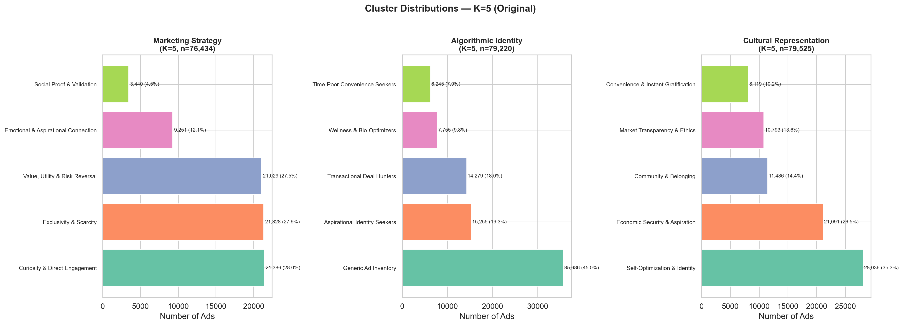

#### Track 2: Algorithmic Identity (K=5)

| Cluster | Ads | % |
|---------|----:|--:|
| Generic Ad Inventory | 35,686 | 45.0% |
| Aspirational Identity Seekers | 15,255 | 19.3% |
| Transactional Deal Hunters | 14,279 | 18.0% |
| Wellness & Bio-Optimizers | 7,755 | 9.8% |
| Time-Poor Convenience Seekers | 6,245 | 7.9% |

#### Track 3: Cultural Representation (K=5)

| Cluster | Ads | % |
|---------|----:|--:|
| Self-Optimization & Identity | 28,036 | 35.3% |
| Economic Security & Aspiration | 21,091 | 26.5% |
| Community & Belonging | 11,486 | 14.4% |
| Market Transparency & Ethics | 10,793 | 13.6% |
| Convenience & Instant Gratification | 8,119 | 10.2% |

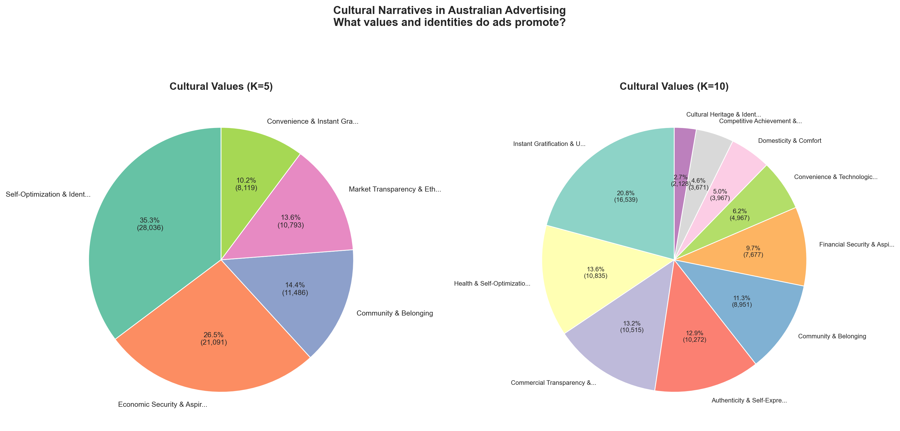

---

### RQ1: How Does the Choice of Analytical Track Affect Clustering?

**The 3 tracks capture fundamentally different dimensions of the same ads.** Cross-track agreement is very low, confirming they are complementary rather than redundant.

| Track Pair | ARI | NMI | Cramer's V |
|------------|----:|----:|-----------:|
| Marketing vs Identity | 0.104 | 0.118 | 0.290 |
| Marketing vs Cultural | 0.052 | 0.080 | 0.241 |
| Identity vs Cultural | 0.089 | 0.168 | 0.367 |

*ARI (Adjusted Rand Index): 0 = random agreement, 1 = identical clusterings. Values below 0.1 indicate the tracks produce fundamentally different groupings.*

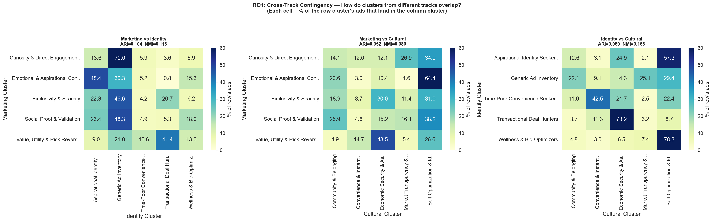

**Track choice matters 2–3x more than platform.** The choice of analytical track has a much larger effect on clustering outcomes than which platform an ad appeared on:

| Source of variation | Cramer's V range | Interpretation |
|---------------------|-----------------|----------------|
| Platform effect on clusters | 0.10 – 0.14 | Weak to moderate |
| Track choice effect on clusters | 0.24 – 0.37 | Moderate to strong |

This means **track selection is the single most important methodological decision** when using ICTC for ad analysis. Running all 3 tracks on the same dataset is strongly recommended — using only one track misses 70–80% of the analytical picture.

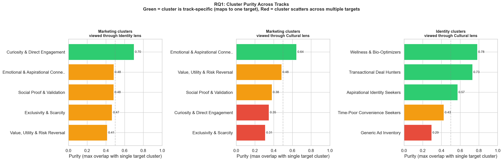

**Conditional entropy analysis** shows that knowing an ad's cluster in one track tells you very little about its cluster in another track (normalized conditional entropy 0.73–0.86). The tracks are genuinely independent analytical dimensions.

---

### RQ2: How Does the Choice of K Affect Clustering?

#### Balance Metrics

| Track | K | Norm. Entropy | Largest Cluster | Effective Clusters | CV |
|-------|--:|:-------------:|:---------------:|:------------------:|:--:|
| Marketing | 5 | 0.909 | 28.0% | 5 | 0.49 |
| Marketing | 10 | 0.839 | 33.8% | 9 | 0.94 |
| Identity | 5 | 0.878 | 45.0% | 5 | 0.66 |
| Identity | 10 | 0.878 | 30.2% | 10 | 0.80 |
| Cultural | 5 | 0.934 | 35.3% | 5 | 0.47 |
| Cultural | 10 | 0.939 | 20.8% | 10 | 0.52 |

*Normalized entropy: 1.0 = perfectly balanced. CV = coefficient of variation of cluster sizes.*

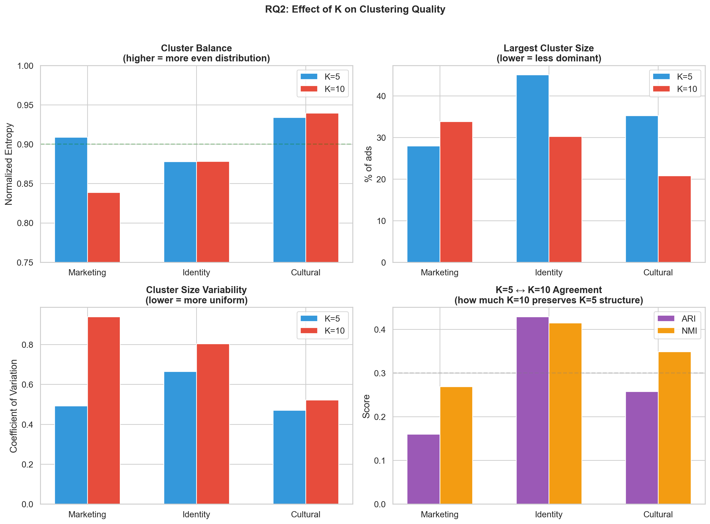

#### K=5 → K=10: Subdivision or Reorganization?

Going from K=5 to K=10 does **not** simply subdivide existing clusters — it significantly reorganizes them:

| Track | ARI (K=5 ↔ K=10) | Interpretation |
|-------|:-----------------:|----------------|
| Marketing | 0.160 | Significant reorganization |
| Identity | 0.429 | Mostly subdivision |
| Cultural | 0.258 | Significant reorganization |

Identity is the most stable track (its K=5 clusters largely map to specific K=10 clusters), while Marketing reorganizes the most.

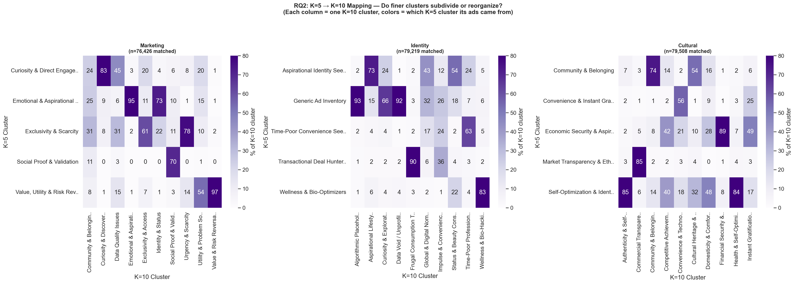

#### The "Noise Sink" Problem at K=10

At K=10, the LLM spontaneously creates dedicated clusters that absorb data quality issues:

| Track | Noise-Sink Cluster | Ads Absorbed | % |
|-------|-------------------|:------------:|--:|
| Marketing K=10 | Data Quality Issues | 25,835 | 33.8% |
| Identity K=10 | Algorithmic Placeholders | 23,957 | 30.2% |
| Identity K=10 | Data Void / Unprofiled | 1,774 | 2.2% |

At K=5, these same noisy ads (hooks like "no ad description provided") are distributed across real clusters — e.g., in Marketing K=5 they go to "Curiosity & Direct Engagement" (72%). K=10 isolates noise, which is both useful (cleaner real clusters) and problematic (inflates the noise category).

**Recommendation:** Start with K=5 for presentation. Use K=10 for deep-dive analysis. Consider K=7–8 as a middle ground (the `ictc_recluster.py` script makes this cheap to test).

---

### Key Findings for the Australian Ad Observatory

#### Finding 1: Platform Differences Are Statistically Significant but Small

All 3 tracks show significant chi-square tests (p < 0.001), but effect sizes are weak to moderate:

| Track | Chi-square | Cramer's V | Strength |
|-------|:----------:|:----------:|----------|
| Marketing Strategy | 2,706 | 0.107 | Moderate |
| Algorithmic Identity | 2,512 | 0.100 | Moderate |
| Cultural Representation | 4,779 | 0.144 | Moderate |

**Implication:** The 4 platforms use remarkably similar advertising playbooks. Advertising regulation does not need to be platform-specific — the strategies are largely universal.

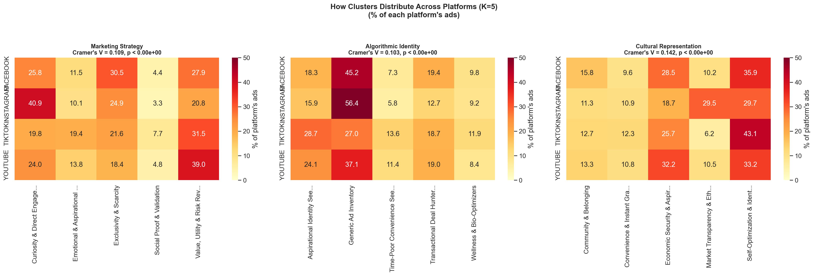
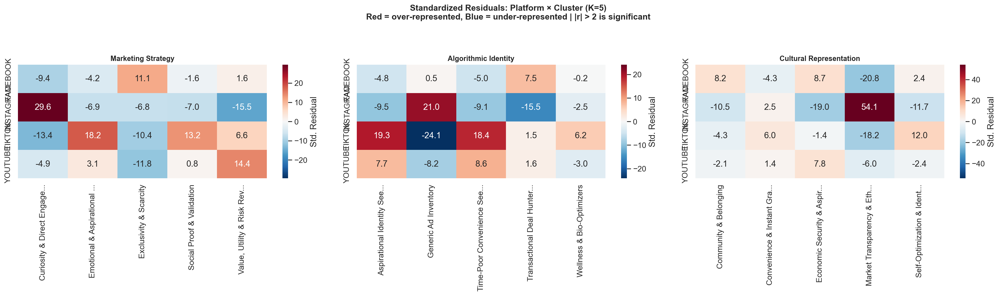

#### Finding 2: The Surveillance Blind Spot

**41.3% of ads in Track 2 show no specific identity profiling** — the "Generic Ad Inventory" cluster represents ads where the platform constructs no meaningful "data double" for the viewer. This challenges the narrative that all digital advertising is hyper-targeted.

| Platform | Generic Ad Inventory | Relative to base rate |
|----------|:--------------------:|:---------------------:|
| Facebook | 64.4% of generic ads | 1.05x (slightly over) |
| Instagram | 24.4% | 1.19x (notably over) |
| TikTok | 6.1% | 0.56x (much less generic) |
| YouTube | 5.0% | 0.70x (less generic) |

**TikTok is the least "generic"** — it does the most identity profiling. Instagram is the most — it serves the highest proportion of untargeted ads relative to its size.

At K=10, the same pattern appears: "Algorithmic Placeholders" (30.2%) + "Data Void / Unprofiled" (2.2%) = 32.5% of ads with no meaningful identity targeting.

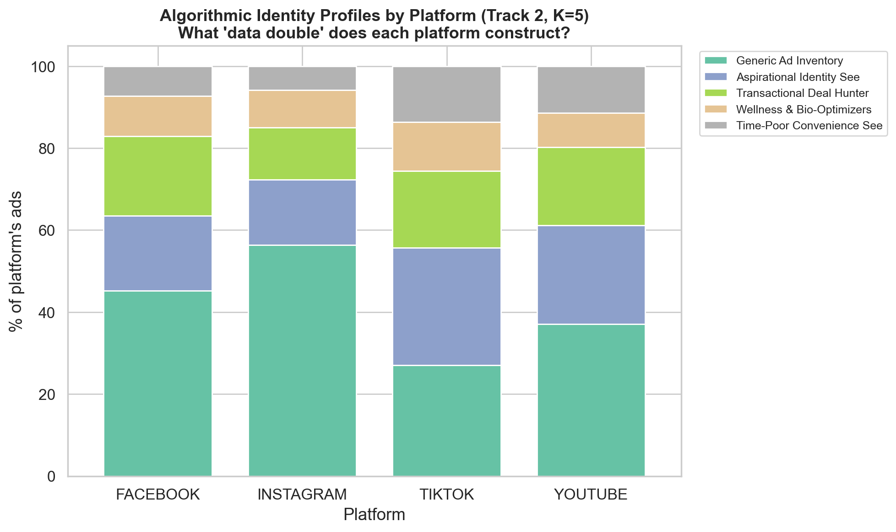

#### Finding 3: "Self-Optimization" Dominates Cultural Narratives

"Self-Optimization & Identity" is the **#1 cultural narrative on every platform** — advertising overwhelmingly frames identity as a project of constant self-improvement:

| Platform | Self-Optimization % |
|----------|:-------------------:|
| TikTok | 43.1% |
| Facebook | 35.9% |
| YouTube | 33.2% |
| Instagram | 29.7% |

TikTok leads with the strongest self-optimization messaging. This is a potential cultural health indicator worth tracking over time.

#### Finding 4: TikTok Is the Most Distinctive Platform

Across all 3 tracks, TikTok shows the most distinctive advertising profile compared to Facebook:

| Track | Cluster | Facebook | TikTok | Difference |
|-------|---------|:--------:|:------:|:----------:|
| Marketing | Emotional & Aspirational | 11.5% | 19.4% | **+8.0pp** |
| Marketing | Exclusivity & Scarcity | 30.5% | 21.6% | **-9.0pp** |
| Identity | Aspirational Identity Seekers | 18.3% | 28.7% | **+10.4pp** |
| Identity | Generic Ad Inventory | 45.2% | 27.0% | **-18.2pp** |
| Cultural | Self-Optimization & Identity | 35.9% | 43.1% | **+7.2pp** |

TikTok uses more emotional/aspirational marketing, does more specific identity targeting (less "generic inventory"), and embeds stronger self-optimization cultural messaging.

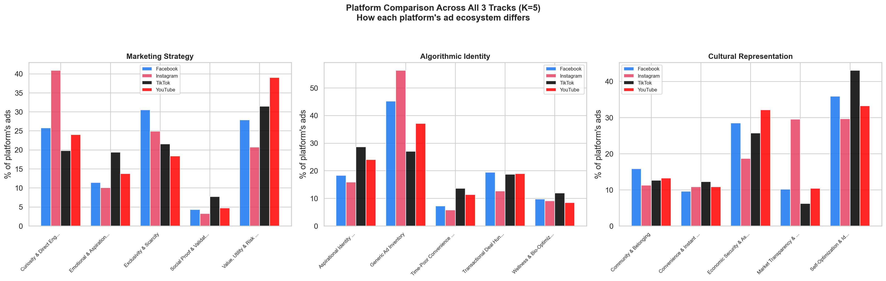

#### Finding 5: YouTube Has the Highest Image Filtering Rate

**30.4% of YouTube ad images were filtered** (broken or UI screenshots), compared to only 5.8% for Facebook. This is an important data quality consideration — YouTube's ad capture via browser extension produces more non-ad screenshots.

| Platform | Filtering Rate |
|----------|:--------------:|
| YouTube | 30.4% |
| TikTok | 20.3% |
| Instagram | 17.7% |
| Facebook | 5.8% |

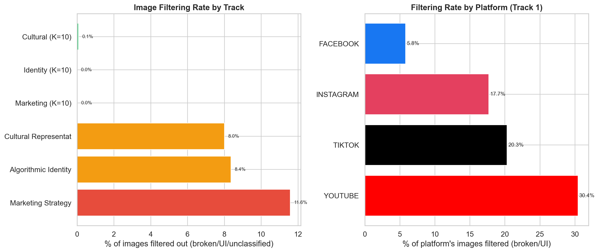

#### Finding 6: Cross-Track Correlations Reveal Advertising Archetypes

The strongest cross-track mappings reveal recurring advertising archetypes:

| Marketing Strategy | → Most Common Identity | → Most Common Cultural Value |
|--------------------|-----------------------|------------------------------|
| Emotional & Aspirational | Generic Ad Inventory (30%) | Self-Optimization & Identity (64%) |
| Value, Utility & Risk Reversal | Generic Ad Inventory (49%) | Economic Security & Aspiration (45%) |
| Exclusivity & Scarcity | Aspirational Identity Seekers (47%) | Economic Security & Aspiration (29%) |
| Social Proof & Validation | Generic Ad Inventory (49%) | Market Transparency & Ethics (36%) |
| Curiosity & Direct Engagement | Generic Ad Inventory (71%) | Self-Optimization & Identity (35%) |

The cross-track Cramer's V values (0.24–0.37) indicate moderate association — the tracks are correlated but far from redundant.

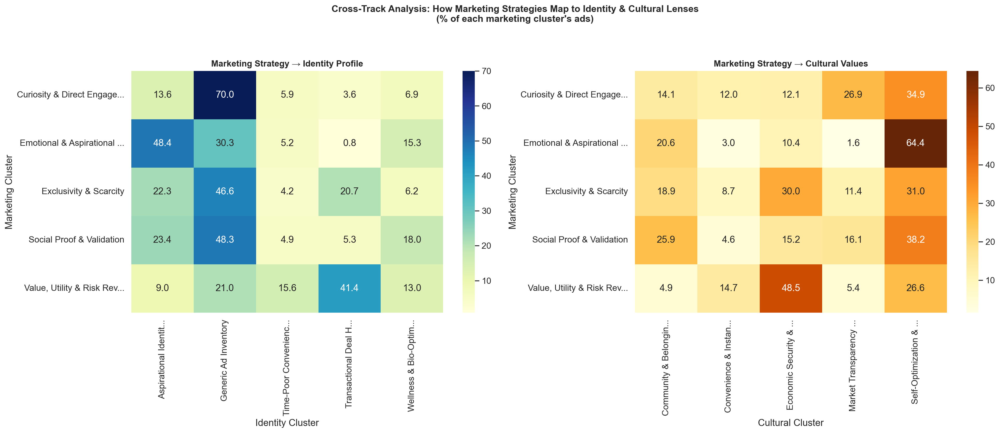

#### Finding 7: Marketplace Ads Cluster Differently

Facebook Marketplace ads (5.4% of all ads, Facebook-only) show distinct patterns:

| Track | Difference vs Non-Marketplace |
|-------|-------------------------------|
| Marketing | +5.8pp Value/Utility, -6.5pp Curiosity |
| Cultural | +7.0pp Self-Optimization, -4.6pp Community |

Marketplace ads are more transactional and less community-oriented. They should be flagged or analyzed separately in aggregate statistics.

---

### Recommendations for Future Researchers

#### Track Selection

| Track | Use when researching... |
|-------|------------------------|
| **Track 1: Marketing Strategy** | Persuasion tactics, dark patterns, consumer manipulation, ad regulation compliance |
| **Track 2: Algorithmic Identity** | Algorithmic profiling, surveillance capitalism, data doubles, discriminatory targeting |
| **Track 3: Cultural Representation** | Cultural narratives, social values, representation, normative messaging |

**Run multiple tracks.** The low cross-track agreement (ARI 0.05–0.10) proves they are complementary — running only one track misses most of the analytical picture.

#### K Selection

| K | Best for... | Trade-offs |
|---|-------------|------------|
| **K=5** | Presentation, initial exploration | All clusters meaningful; no noise sinks; easier to communicate |
| **K=7–8** | Balanced analysis | Untested but cheap to try via `ictc_recluster.py` |
| **K=10** | Deep-dive content analysis | Finer themes emerge (e.g., "Domesticity & Comfort"); but noise-sink clusters absorb 30–34% |

#### Data Quality

1. **Pre-filter UI screenshots** before VLM captioning — a simple CNN classifier (ResNet-18) could save 8–12% of GPU time
2. **Pre-tag "Sponsored-only" ads** (~3%) and exclude from hook extraction
3. **Visual-only ads** (~7% with hooks like "no ad description provided") reflect a genuine limitation of text-based clustering — future work should add image-embedding clustering (CLIP/SigLIP)

#### Future Directions

**Immediate (current infrastructure):**
1. **Multi-K consensus clustering** — Run K=5,7,10,15 and compute consensus; ads that cluster together across K values are the most robust
2. **Track fusion** — Combine labels from all 3 tracks for richer "advertising archetypes" (e.g., "Scarcity Marketing + Deal Hunter + Instant Gratification")
3. **Temporal analysis** — The dataset has timestamps; track cluster distribution shifts over time
4. **Advertiser-level analysis** — Group by brand (extractable from VLM captions) to see which companies use which strategies

**Medium-term:**
5. **Larger models** — Qwen 3.5-27B outperformed 9B in the 300-image pilot (Experiment 3B); running 86K ads on 27B would likely improve cluster coherence
6. **Visual embedding clustering** — CLIP/SigLIP image embeddings to capture visual strategies that text-based hooks miss
7. **Multi-country comparison** — Same pipeline on non-Australian Ad Observatory datasets to reveal cross-cultural advertising differences
8. **Longitudinal monitoring** — Deploy as a scheduled job to track advertising ecosystem changes over time

---

### Analysis Figures Reference

#### Exploratory Data Analysis (`eda_and_findings.py`)

| Figure | Description |
|--------|-------------|
| [`01_platform_distribution.png`](analysis/figures/01_platform_distribution.png) | Platform pie chart and ad format breakdown |
| [`02_cluster_distributions_k5.png`](analysis/figures/02_cluster_distributions_k5.png) | K=5 cluster distributions for all 3 tracks |
| [`03_cluster_distributions_k10.png`](analysis/figures/03_cluster_distributions_k10.png) | K=10 cluster distributions for all 3 tracks |
| [`04_cluster_balance.png`](analysis/figures/04_cluster_balance.png) | Entropy, largest cluster %, effective clusters |
| [`05_platform_cluster_heatmap_k5.png`](analysis/figures/05_platform_cluster_heatmap_k5.png) | Platform x cluster heatmaps with chi-square stats |
| [`06_format_cluster_heatmap.png`](analysis/figures/06_format_cluster_heatmap.png) | Ad format x cultural values heatmap (Track 3, K=10) |
| [`07_platform_profiles.png`](analysis/figures/07_platform_profiles.png) | Each platform's cluster fingerprint across all tracks |
| [`08_hook_diversity.png`](analysis/figures/08_hook_diversity.png) | Top 20 VLM-generated labels and diversity metrics |
| [`09_data_quality.png`](analysis/figures/09_data_quality.png) | Image filtering rate by track and platform |
| [`10_k5_vs_k10.png`](analysis/figures/10_k5_vs_k10.png) | K=5 vs K=10 entropy and largest cluster comparison |
| [`11_residuals_heatmap.png`](analysis/figures/11_residuals_heatmap.png) | Standardized residuals: where platforms deviate most |
| [`12_cross_track_correlation.png`](analysis/figures/12_cross_track_correlation.png) | Marketing → Identity and Marketing → Cultural mappings |
| [`13_platform_comparison.png`](analysis/figures/13_platform_comparison.png) | Side-by-side platform comparison across all 3 tracks |
| [`14_identity_profiling.png`](analysis/figures/14_identity_profiling.png) | "Data double" identity composition by platform |
| [`15_cultural_values.png`](analysis/figures/15_cultural_values.png) | Cultural narrative pie charts: K=5 vs K=10 |

#### Research Questions (`research_findings.py`)

| Figure | Description |
|--------|-------------|
| [`rq1_01_cross_track_contingency.png`](analysis/figures/rq1_01_cross_track_contingency.png) | How clusters from different tracks overlap (with ARI/NMI) |
| [`rq1_02_cluster_purity.png`](analysis/figures/rq1_02_cluster_purity.png) | Which clusters are track-specific vs cross-cutting |
| [`rq2_01_k5_to_k10_mapping.png`](analysis/figures/rq2_01_k5_to_k10_mapping.png) | K=5 → K=10: subdivision vs reorganization |
| [`rq2_02_k_effect_summary.png`](analysis/figures/rq2_02_k_effect_summary.png) | 4-panel K effect comparison |
| [`rq_summary.png`](analysis/figures/rq_summary.png) | One-page research summary |
